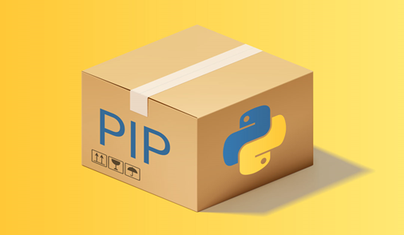

# Template for python package test

## required action secrets
- codecov_token
  - adds test code coverage annotations to PRs
- flake8_token #TODO: rename token
  - github token for read and write access 
  - required to update PRs with actions
- pypi_test_token
  - Api token for pypi test releases
  - required for python package test release
- pypi_token
  - api token for pypi release
  - required for python package release
